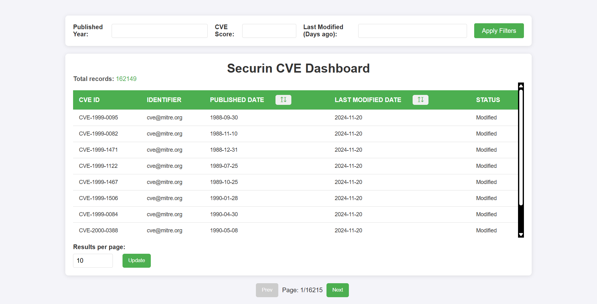

# Securin CVE Dashboard - Client

This is the frontend of the Securin CVE Dashboard project, developed using HTML, CSS, and JavaScript. It consumes the backend API to display CVE data, including search, pagination, and detail views.

## Features

- Display a list of CVE records.
- Pagination for seamless navigation through pages.
- Responsive and interactive UI.
- Click on a row to view detailed CVE descriptions.
- Customize records per page.

## Run the client

- Clone the repository:

```bash
    git clone https://github.com/YadamVinay369/SecurinClient.git
```

- Navigate to the client folder:

```bash
    cd client
```

- Open `index.html` in your browser to start the dashboard.

## Configuration

- The API base URL can be modified in `script.js`:

```javascript
const API_URL = "https://securinserver.onrender.com/api/cve";
```

## UI

- Screenshot of DashBoard



- Screenshot of Description


